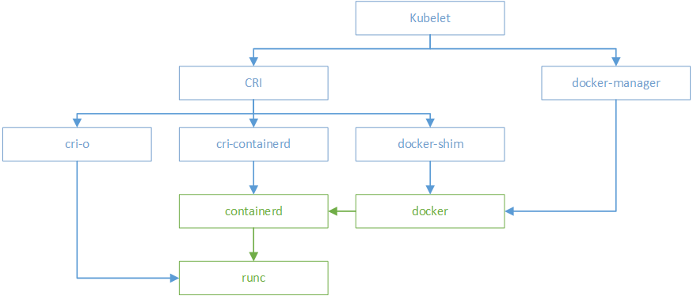
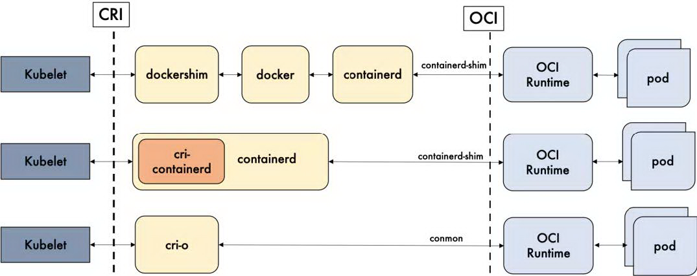
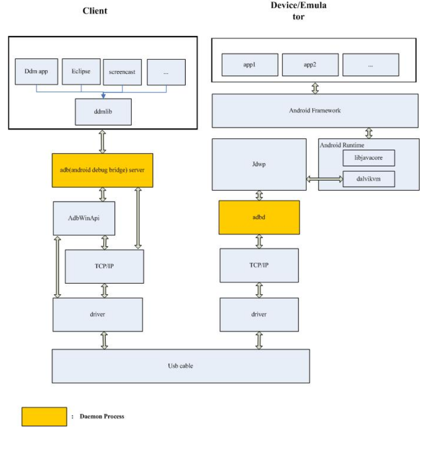
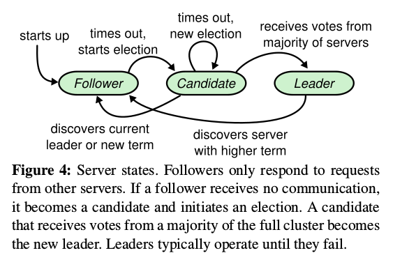
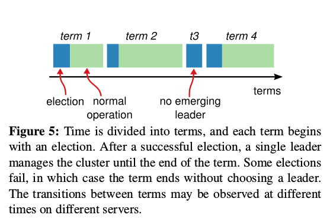

## 树莓派如何关机
adb reboot -p
## android adb 重载系统根目录为读写
mount rw,remount rootfs /
## /var/run目录下pid文件的作用
linux系统中/var/run/目录下的*.pid文件是一个文本文件，其内容只有一行，即某个进程的PID。.pid文件的作用是防止进程启动多个副本，只有获得特定pid文件（固定路径和文件名）的写入权限（F_WRLCK）的进程才能正常启动并将自身的进程PID写入该文件，其它同一程序的多余进程则自动退出。
## oci
open container initiative(https://xuanwo.io/2019/08/06/oci-intro/)

## APUE(advanced programming in the unix environment)
## gcc
- 默认预处理，编译，汇编，链接至最后的可执行文件。
- -c 生成.o(obj文档)
- -S 生成.s(汇编代码)
- -E 生成预处理后的文档，没有具体后缀
- -o 设定输出
## vim 跳转（命令模式）
- ctrl+o 向后跳转
- ctrl+i 向前跳转
## 工作目录
每个进程都有一个工作目录，有时称为当前工作目录。所有相对路径名都是从工作目录开始解释。进程可以用chdir函数更改其工作目录。
## 作业
- 分布式：基于raft协议的分布式缓存
- 大数据：
	- 读书报告（基于raft协议的分布式缓存）
	- sougou数据分析
- PaaS: 基于k8s的安卓集群应用控制。
## go包
- spf/cobra：CLI命令行库
## adb运行流程

## android 沙箱
Android applications run on a VM (Virtual Machine), and are completely isolated one from another due to the permissions Android gives each app. Basically each application on android is a separate user, and they have their own space on the "disk". That means Applications cannot access each other's space, Cannot uninstall or mess with each others data.

Only one user has access to OS and all applications, it's the root. So when people "root" their phone, they basically get root permissions, and can mess with every application including system services and libraries. But that's off topic

Android provides layer of protection in that it doesn’t give one app access to the resource of another app. This is known as the ‘sandbox’ where every app gets to play in its own sandbox and can’t use another app’s toys! Android does this by giving each app a unique user id (a UID) and by running that app as a separate process with that UID. Only processes with the same UIDs can share resources which, as each ID is uniquely assigned, means that no other apps have permission.
## android 进程树
- init
- zygote
- system_server:dalvik(system_servers:java)
	- package manager service(app的安装与卸载)
	- activity manager service(app的启动与停止)
	- ...
## markdown
`-`只能用来做列表，不好作为小标题

markdown中为了兼容HTML,尖括号无法由`\`转义输出，应通过`&lt;文字&gt;`输出尖括号:&lt;文字&gt;
## raft
#### 竞选机制  

  
raft采用心跳机制触发leader竞选。当servers启动时，他们都处于followers状态，且只要他们持续收到从leader或candidate发来的有效RPCs请求，就会持续保持followers状态。leader向followers发送周期性心跳(AppendEntries RPCs that carry no log entries)以维持其权威。如果一个follower在一个段时间内没有接受到任何RPCs请求(称为election timeout)，就会认为当前没有存活leader并开始试图竞选称为leader: 
1. 当前周期(term)加一
1. 将节点状态转变为candidate
1. 向集群中的其他servers并行发送RequestVote RPCs  

一个candidate保持其candidate状态直到下列三个事情发生:
1. 赢得选举，转向leader状态
1. 另一个candidate赢得选举并接收到其发送的心跳包，返回follower状态
1. 一周期时间内没有人赢得选举。

若candidate在一个term内赢得集群中大部分选票，则其赢得选举。follower根据谁先来给先给谁投票的原则，一个term内其只投出一张选票给最先发来请求的candidate。大多数原则保证了在一个term内仅有一个leader产生。leader产生后向集群中的其他server发送心跳包建立权威和阻止新的竞选。

follower由于收到leader的心跳包而转变成candidate参与竞选，等待选票时，可能又会收到来自旧leader，或者在断开与leader连接时集群中新leader的心跳包。
1. 来自旧leader的心跳包(**candidate_term>心跳包_term**)，由于此时candidate的term大于旧leader的term，此心跳包被丢弃。
1. 来自同一term的leader的心跳包，即其竞选失败(**candidate_term=心跳包_term**)，被其他candidtae抢先，将状态转为follower。
1. 来自新term的心跳包包(**candidate_term&lt;心跳包_term**)，将状态转为follower。

